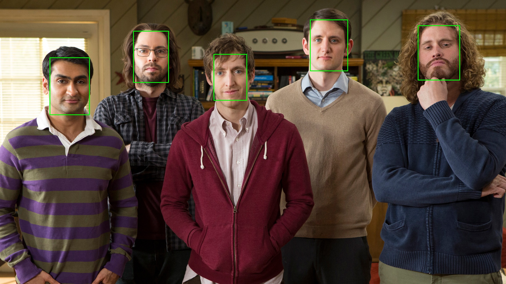
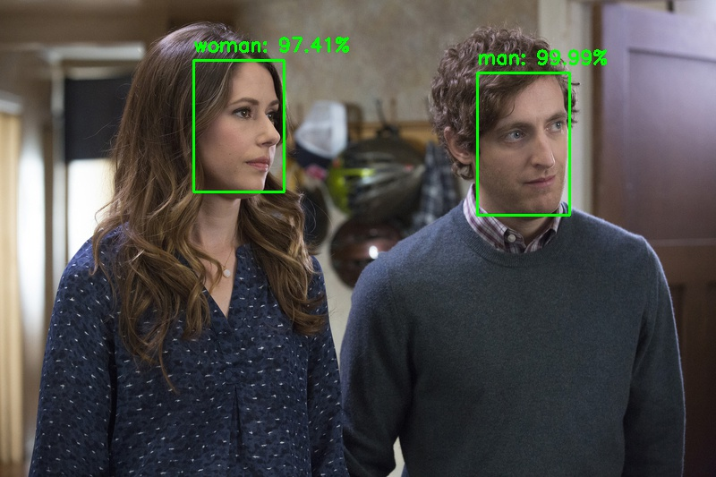
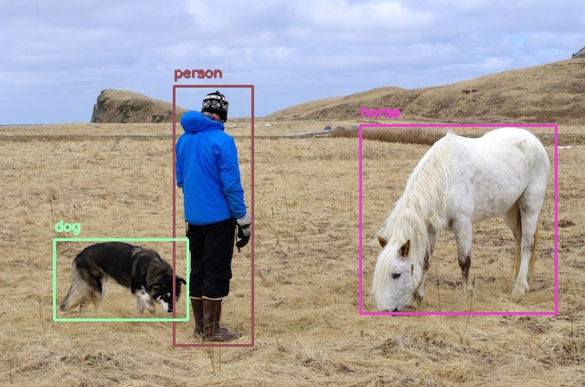

[](http://pepy.tech/project/cvlib)  [](https://gitter.im/arunponnusamy/cvlib?utm_source=badge&utm_medium=badge&utm_campaign=pr-badge)

# cvlib
A high level easy-to-use open source Computer Vision library for Python.

## Installation

### Installing dependencies

Provided the below python packages are installed, cvlib is completely pip installable.

* OpenCV
* TensorFlow

If you don't have them already installed, you can install through pip

`pip install opencv-python tensorflow` 

#### Optional
or you can compile them from source if you want to enable optimizations for your specific hardware for better performance.
If you are working with GPU, you can install `tensorflow-gpu` package through `pip`. Make sure you have the necessary Nvidia drivers  installed preoperly (CUDA ToolKit, CuDNN etc). 

If you are not sure, just go with the cpu-only `tensorflow` package.

### Installing cvlib

`pip install cvlib`

To upgrade to the newest version
`pip install --upgrade cvlib`

#### Optional
If you want to build cvlib from source, clone this repository and run the below commands.
```
git clone https://github.com/arunponnusamy/cvlib.git
cd cvlib
python setup.py sdist
pip install .
```

**Note: Compatability with Python 2.x is not officially tested.**

## Face detection
Detecting faces in an image is as simple as just calling the function `detect_face()`. It will return the bounding box corners and corresponding confidence for all the faces detected.
### Example :

```
import cvlib as cv
faces, confidences = cv.detect_face(image)
```
Seriously, that's all it takes to do face detection with `cvlib`. Underneath it is using OpenCV's `dnn` module with a pre-trained caffemodel to detect faces.

Checkout `face_detection.py` in `examples` directory for the complete code.

### Sample output :



## Gender detection
Once face is detected, it can be passed on to `detect_gender()` function to recognize gender. It will return the labels (man, woman) and associated probabilities.

### Example

`label, confidence = cv.detect_gender(face) `

Underneath `cvlib` is using a [pre-trained](https://github.com/arunponnusamy/gender-detection-keras) keras model to detect gender from face. The accuracy is not so great at this point. It still makes mistakes. Working on adding a more accurate model.

Checkout `gender_detection.py` in `examples` directory for the complete code.

### Sample output :



## Object detection
Detecting common objects in the scene is enabled through a single function call `detect_common_objects()`. It will return the bounding box co-ordinates, corrensponding labels and confidence scores for the detected objects in the image.

### Example :

```
import cvlib as cv
from cvlib.object_detection import draw_bbox

bbox, label, conf = cv.detect_common_objects(img)

output_image = draw_bbox(img, bbox, label, conf)
```
Underneath it uses [YOLOv3](https://pjreddie.com/darknet/yolo/) model trained on [COCO dataset](http://cocodataset.org/) capable of detecting 80 [common objects](https://github.com/arunponnusamy/object-detection-opencv/blob/master/yolov3.txt) in context.

Checkout `object_detection.py` in `examples` directory for the complete code.

### Real time object detection
`YOLOv3` is actually a heavy model to run on CPU. If you are working with real time webcam / video feed and doesn't have GPU, try using `tiny yolo` which is a smaller version of the original YOLO model. It's significantly fast but less accurate.

```
bbox, label, conf = cv.detect_common_objects(img, confidence=0.25, model='yolov3-tiny')
```
Check out the [example](examples/object_detection_webcam_yolov3_tiny.py) to learn more.

### Sample output :



## License
cvlib is released under MIT license.

## Help
For bugs and feature requests, feel free to file a [GitHub issue](https://github.com/arunponnusamy/cvlib/issues). (Make sure to check whether the issue has been filed already) 

For usage related how-to questions, please create a new question on [StackOverflow](https://stackoverflow.com/questions/tagged/cvlib) with the tag `cvlib`.
